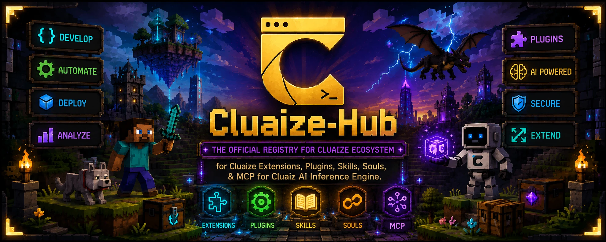
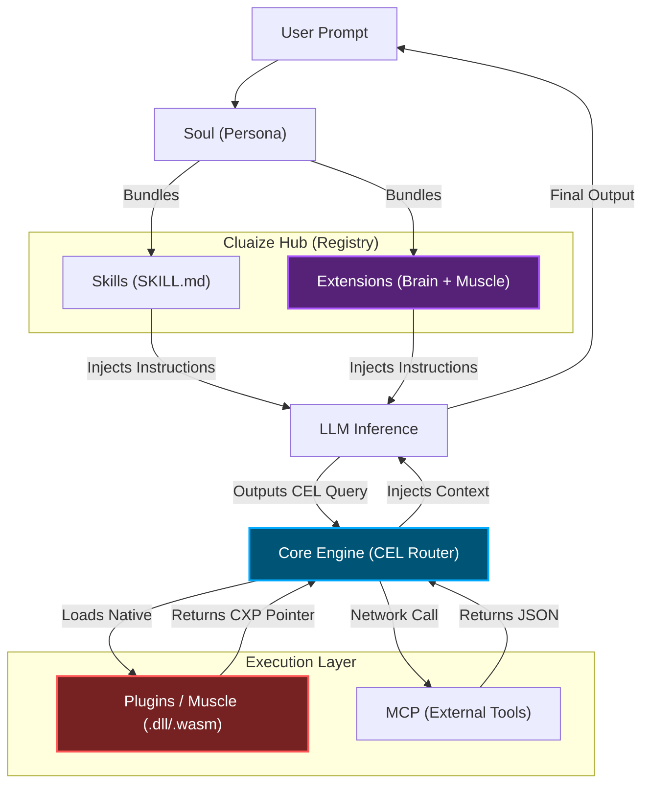

<p align="center">
  
</p>

<h1 align="center">Cluaize Hub</h1>

<p align="center">
  <strong>The Official Central Registry for Cluaize Extensions, Plugins, Skills, Souls, & MCP.</strong>
</p>

<p align="center">
  <a href="https://github.com/cluaiz/skills/actions"></a>
  <a href="LICENSE"></a>
</p>

---

## 🌟 What is this?

This repository (**Cluaize Hub**) is the central nervous system for the Cluaize Inference Engine. It contains everything needed to extend the core engine's capabilities, give the AI new knowledge, and define agent personas.

The Cluaize architecture enforces a strict decoupling of logic from the Core Engine. The engine itself is a "dumb router"; all actual capabilities live here in this Hub.

---

## 🏗️ The 5 Pillars of Cluaize Ecosystem

To understand how to build and contribute, you must understand the strict Cluaize Taxonomy.

### 1. 🧩 Extensions (The Brain + Muscle Bundle)
An **Extension** extends the entire system's behavior. It is a bundle that combines the Brain (instructions) and the Muscle (native code).
- **Example:** `cluaize-database` (cluaizd). It contains a `SKILL.md` (to teach the AI how to write database queries) AND the native `cluaizd_engine.dll` (to actually execute them).

### 2. 🔌 Plugins (The Functional Muscle)
A **Plugin** is a standalone, compiled third-party binary (`.dll`, `.wasm`, `.so`) that gives the engine a specific hardware or OS-level capability.
- **Example:** A heavy image-processing algorithm or a native web scraper. The engine loads this into memory and passes execution pointers to it.

### 3. 🧠 Skills (The AI Recipes)
A **Skill** is pure workflow and logic formatting (Markdown/CEL). It does not contain executable binaries. It teaches the AI *how* to use existing plugins or APIs.
- **Example:** A "Summarize Document" skill that instructs the AI on the exact format to return. It uses a `SKILL.md` file.

### 4. 👤 Souls (Personas)
A **Soul** defines an AI agent's core identity, constraints, and bundles specific Skills together.
- **Example:** `Senior_Rust_Developer` soul. It is bundled with the "Cargo Build" skill and the "Terminal" plugin, but restricted from accessing the "Medical Database".

### 5. 🌐 MCP (Model Context Protocol)
External standard connectors. If a tool runs on a completely different server (like Slack or GitHub), an MCP connector bridges it to the Cluaize Engine.

---

## 📂 Repository Structure

```text
cluaiz-hub/
├── extensions/                  # Bundled (Brain + Muscle) systems
│   └── cluaize-database/        # Example: The cluaizd database framework
│       ├── manifest.json        # Capabilities & limits
│       ├── SKILL.md             # The Brain
│       └── native/              # The Muscle (.dll/.wasm)
│
├── plugins/                     # Standalone Muscle binaries (No Brains)
│   ├── web-scraper/
│   └── audio-transcriber/
│
├── skills/                      # Standalone Brain recipes (No Muscle)
│   ├── productivity/
│   └── coding/
│
├── souls/                       # Core Personas
│   └── hacker/
│       └── SOUL.md
│
├── mcp/                         # External connectors
│
├── doc/                         # Deep Documentation
└── registry.json                # Auto-generated index of all modules
```

---

## 🔄 End-to-End Core Mechanism (How it works)



When the user queries the Engine, here is how an **Extension** (like the Database) flows:

1. **Extension Load:** The Engine reads the `cluaize-database` extension and injects the `SKILL.md` into the AI's context window.
2. **AI Inference:** The AI reads the instructions and outputs a CEL Query: `use plugin::database -> find User`.
3. **Engine Routing:** The Engine intercepts the CEL string, realizes it needs the database, and loads the Muscle (`native/cluaizd_engine.dll`).
4. **Native Execution:** The Engine executes the DLL at 0.05ms latency via C-FFI and passes the resulting memory pointer back to the AI context.

---

## 🚀 Quick Start (CLI)

You can install any module from the Hub directly via the Cluaize CLI:

```bash
# Install an entire Extension
cluaiz install extension cluaize-database

# Install a standalone Skill
cluaiz install skill doc-summarizer

# Apply a Soul to an Agent
cluaiz soul set Senior_Rust_Developer
```

## 📜 Documentation

- [Contributing Guidelines](CONTRIBUTING.md)
- [Security Policy](SECURITY.md)
- [Ecosystem Vision](VISION.md)

## ⚖️ License
[Apache 2.0](LICENSE) © 2026 Cluaiz Technologies
