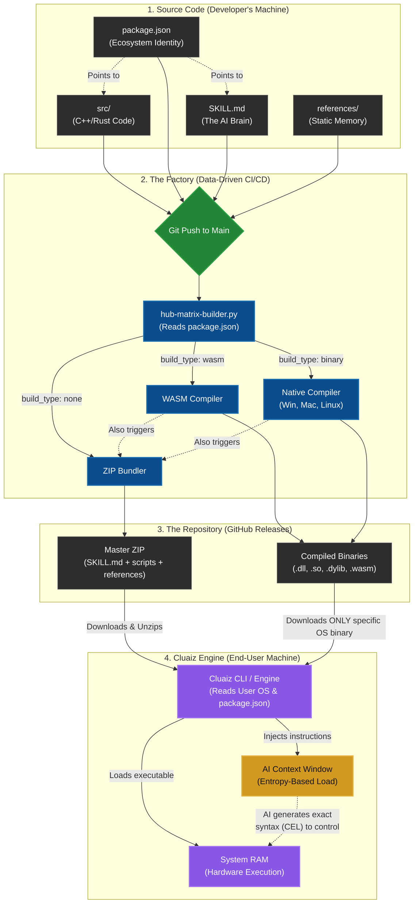

# 🏛️ The Cluaiz Hub Architecture & Dynamic Build Pipeline

This document serves as the **Single Source of Truth** for the Cluaiz Hub's Data-Driven CI/CD Pipeline and Package Architecture. It explains exactly how the registries work, how the Masterpiece `package.json` schema controls the build process, and provides a step-by-step guide for developers on how to create, build, and release extensions, plugins, skills, and MCP servers.

---

## 🧬 1. The Core Philosophy: Data-Driven CI/CD

In the Cluaiz ecosystem, developers **never** manually compile binaries, create GitHub releases, or write custom workflow YAML files for their extensions. 

The entire CI/CD pipeline is **Data-Driven**. There is a single Master Python Script (`hub-matrix-builder.py`) and a single Master YAML workflow. This system tracks `git diff`, reads the `package.json` of the modified extension, and dynamically spawns parallel build jobs (Windows, macOS, Linux, WASM) based entirely on the JSON configuration.

---

## 🗂️ 2. The Registry Hierarchy

To maintain order across thousands of plugins, the Hub uses a strict 3-tier routing architecture.

### A. The Master Registry (`registry.json`)
Located at the root of `cluaiz-hub/`. It is the absolute entry point for the Cluaiz Engine. It maps every top-level category to its respective `family.json` file.
```json
{
  "version": "1.0.0",
  "updated": "2026-06-30T10:00:00Z",
  "routing": {
    "extensions": "extensions/family.json",
    "plugins": "plugins/family.json",
    "skills": "skills/family.json",
    "mcp": "mcp/family.json",
    "souls": "souls/family.json"
  }
}
```

### B. The Category Router (`family.json`)
Located inside each category folder (e.g., `extensions/family.json`). It acts as a directory of all items within that family. The Engine parses this to find specific packages without scanning the entire repo.
```json
{
  "category": "extensions",
  "description": "Deep OS-level integrations requiring native compiled binaries.",
  "items": {
    "cluaize-search": "cluaize-search/package.json",
    "cluaize-database": "cluaize-db/package.json",
    "cluaize-vision": "cluaize-vision/package.json",
    "cluaize-terminal": "cluaize-terminal/package.json",
    "cluaize-audio": "cluaize-audio/package.json"
  }
}
```

### C. The Package Metadata (`package.json`)
This is the heart of the system. It dictates how the AI understands the tool and how the CI/CD pipeline builds it.

---

## 📦 3. The "Masterpiece" `package.json` Schema (Deep Dive)

The `package.json` is the absolute heart of the Hub. It dictates how the AI understands the tool, how the Engine downloads it, and how the CI/CD pipeline builds it. Every key has a critical purpose.

### The Complete JSON Structure
Here is a full example of a perfectly structured Extension package:

```json
{
  "id": "cluaiz-search",
  "name": "Cluaiz Search Extension",
  "title": "Cluaiz Search",
  "category": "search",
  "hub_type": "extension", 
  "build_type": "binary",
  "github_action": true,
  "logo": "/assets/cluaiz-search.webp",
  "title": "Cluaiz Local Search Indexer",
  "description": "Powerful local search indexing extension for the Cluaiz Engine. Enables lightning-fast, privacy-first data retrieval and exact match indexing without internet dependency. Securely organizes your local workspace for real-time AI access.",
  "tags": [
    "Search",
    "Inverted-Index",
    "Cross-platform",
    "Retrieval"
  ],
  "documentation": "https://github.com/cluaiz/cluaiz-hub/blob/main/extensions/cluaize-search/README.md",
  "latest_version": "0.1.0",
  "versions": {
    "0.1.0": {
      "updated_at": "2026-06-30T18:00:00Z",
      "builds_os": ["windows", "macos", "linux"],
      "changelog": "Nightly release with latest native performance improvements.",
      "os": {
        "windows": "https://github.com/cluaiz/cluaiz-hub/releases/download/ext-cluaiz-search-v0.1.0/cluaiz-search_windows_x64.dll",
        "macos": "https://github.com/cluaiz/cluaiz-hub/releases/download/ext-cluaiz-search-v0.1.0/libcluaiz-search_macos_arm64.dylib",
        "linux": "https://github.com/cluaiz/cluaiz-hub/releases/download/ext-cluaiz-search-v0.1.0/libcluaiz-search_linux_x64.so"
      },
      "files": {
        "skill": "/SKILL.md",
        "scripts": "/scripts",
        "references": "/references",
        "manifest": "/manifest-extension.yaml",
        "file_directory": "https://github.com/cluaiz/cluaiz-hub/releases/download/ext-cluaiz-search-v0.1.0/cluaiz-search-files.zip"
      }
    }
  }
}
```

### Deep Field Breakdown

#### Level 1: Ecosystem Identity & Typing
- `id`, `name`, `title`: Unique identifiers used in the CLI and UI to display the package.
- `logo`: A relative path (e.g. `"/assets/cluaiz-search.webp"`) that points to a local directory *inside* the package's folder (e.g., `extensions/cluaize-search/assets/`). During the CI/CD build, this local `assets/` directory is automatically bundled into the Master ZIP, so the Engine extracts the logo locally without needing external CDNs.
- `github_action`: A boolean flag (`true` or `false`). If `false`, the CI/CD pipeline will completely ignore this package and skip all build jobs, even if files were modified. This provides a hard manual override at the top level to disable automated builds.
- `hub_type` (What is this package?):
  - `"extension"`: Deep OS integrations. Requires highly optimized binaries (`.dll`, `.so`) and always requires a `SKILL.md` to teach the AI how to use it safely.
  - `"plugin"`: Independent modular tools. Can be compiled to WASM or Native. `SKILL.md` is optional but recommended.
  - `"skill"`: Pure Prompt Engineering. Contains no executable code. Relies entirely on `SKILL.md` and reference text files.
  - `"mcp"`: Model Context Protocol servers. Usually Python or Node.js scripts bundled with a `SKILL.md`.
- `build_type` (How should the CI/CD compile this?):
  - `"binary"`: The pipeline triggers native compilers (C++/Rust) across a dynamic OS matrix (Windows, Linux, macOS).
  - `"wasm"`: The pipeline triggers a WASM compiler (`wasm32-wasi`).
  - `"none"`: Used for `skills` and `mcp`. The pipeline skips compilation and goes straight to the ZIP bundling phase.

#### Level 2: Granular Version Control (`versions`)
The `versions` object gives developers explicit control over every historical version of their tool.

- `updated_at`: The absolute timestamp of this version build (e.g. `2026-06-30T10:00:00Z`). **Security & Caching:** The CI/CD Python script and the Engine use this time signature. If a developer builds 10 times a day without bumping the version number (e.g., `v0.1.0`), they MUST change this timestamp. The build action will NOT trigger unless this time is modified.
- `builds_os`: An array defining exactly which targets to compile. E.g., adding `"android"` to this array tells the CI/CD to instantly spin up mobile compilation targets.
- `os` (The Heavy Binaries): 
  - Explicit URLs to the OS-specific compiled binaries on GitHub Releases. 
  - *Why separate from the ZIP?* We do not bloat a single ZIP with 50MB of `.dll` and `.so` files for every OS. The Cluaiz Engine reads the user's OS, and downloads *only* the specific binary required.
- `files` (The Master ZIP & Local Pointers): 
  - `file_directory`: A direct link to a **Master ZIP** archive containing all static text assets (like `SKILL.md`, `README.md`, `scripts/`, `references/`). The engine downloads this ZIP to extract the core non-binary files.
  - `skill`, `scripts`, `references`: Relative paths mapping logical components to the unzipped files (e.g., `"/SKILL.md"`). This tells the Cluaiz Engine exactly where to look for critical assets **after** the Master ZIP is downloaded and extracted. The Engine will then drop the OS binary into this exact folder, merging everything locally.

---

## 🤖 4. The Role of `SKILL.md` and `references/`

### The Brain (`SKILL.md`)
If a package contains a `SKILL.md`, it is the **Identity and Instruction Manual** for the AI. It uses strict YAML frontmatter and precise CEL (Cluaiz Execution Language) grammar to prevent hallucinations.
- When an extension is loaded, the `.dll` goes to the OS, but the `SKILL.md` goes directly into the AI's prompt.

### The Memory (`references/` & `scripts/`)
For massive skills (e.g., Code Reviewers), putting 10,000 lines of documentation inside `SKILL.md` causes context window bloat and OOM crashes.
- Instead, developers place raw markdown/txt files in the `references/` folder.
- The Engine lazy-loads these references only when the AI's entropy threshold demands deeper context.
- All of these folders are automatically bundled into the Master ZIP by the CI/CD pipeline.

---

## ⚙️ 5. How the Dynamic CI/CD Pipeline Actually Works

The `master-hub-builder.yml` and `hub-matrix-builder.py` operate in 4 distinct phases:

### Phase 1: Git Diff Detection
When a developer pushes to `main`, the Python script runs `git diff HEAD^ HEAD`. It detects exactly which folders (e.g., `extensions/cluaize-search`) were modified.

### Phase 2: Matrix Generation
For every modified package, the script reads `package.json`. 
- If it sees `build_type: binary`, it dynamically outputs a GitHub Actions matrix for `['windows-latest', 'ubuntu-latest', 'macos-14']`.
- If it sees `build_type: none`, it outputs a single matrix job for bundling.

### Phase 3: Compilation & ZIP Bundling
The runners compile the source code (if applicable). Then, a universal bundling step occurs:
```bash
zip -r package.zip SKILL.md README.md scripts/ references/
```
*Note: The binary is kept separate from the ZIP.*

### Phase 4: Rolling Release Upload
The pipeline uploads the files to a permanent, rolling GitHub Release tag (e.g., `ext-cluaize-search`). 
- It uploads `cluaize_search_windows_x64_v0.1.0.dll`
- It uploads `cluaize_search_v0.1.0.zip` (The Master ZIP)
This ensures we don't spam the repository with 20,000 unique releases.

---

## 🛠️ 6. Developer Guideline: How to Build & Release a New Extension

If you want to contribute a new tool to the Cluaiz Ecosystem, follow these exact steps:

### Step 1: Create the Structure
Create your folder in the correct category: `extensions/my-new-tool/`.
Inside, create the standard files:
- `README.md` (Human documentation)
- `SKILL.md` (AI instructions)
- `src/` (Your C++/Rust/Python code)

### Step 2: Write the `package.json`
Copy the "Masterpiece" schema. 
- Set your `hub_type` (extension, plugin, skill).
- Set your `build_type` (binary, wasm, none).
- Ensure your `files` block points to `/SKILL.md`.

### Step 3: Trigger the Build (Zero Maintenance)
You do **not** need to compile anything yourself. 
You do **not** need to touch `.github/workflows`.
1. Commit your changes.
2. Push to the `main` branch.

### Step 4: Watch the Magic
The Dynamic Pipeline will detect your new folder, read your `build_type`, automatically spawn the necessary virtual machines, compile your code, ZIP your `SKILL.md`, and upload everything to the exact URLs you specified in your `package.json`.

---

## 🔄 7. Version Control & Re-releases

What if you made a typo in `SKILL.md` and need to rebuild `v0.1.0` without bumping to `v0.2.0`?
- Simply push the fix. Because the Pipeline is dynamic, it will detect the diff, re-compile, and gracefully overwrite the existing `v0.1.0` binaries on the release tag. 
- To delete an old version, simply remove it from the `"versions"` object in `package.json` and delete the asset from the GitHub Release page. The Cluaiz Engine will immediately stop serving it.

---

## 🏗️ 8. The Factory Architecture (Mermaid Diagram)

The following diagram illustrates the complete lifecycle of a Cluaiz package—from the developer's source code, through the Data-Driven CI/CD pipeline, onto GitHub Releases, and finally into the Engine's memory and the AI's context window.


