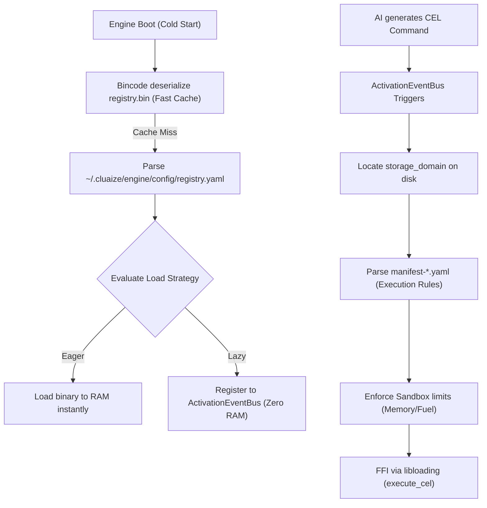

# Two-Tier Extension Architecture: Registry and Manifest

## 1. Diátaxis: Explanation (Architectural Deep Dive)

This document explains the Two-Tier Registry Architecture governing how the Cluaize Engine discovers, indexes, and executes extensions without O(N) directory scanning during boot.

---

## 2. Architectural Flow

The engine uses a strict separation of concerns between **Indexing** (`registry.yaml`) and **Execution Rules** (`manifest-extension.yaml` / `manifest-plugin.yaml` / `manifest-mcp.yaml`).

---

## 3. The Master Registry (`MasterRegistry`)
**Source of Truth File:** `~/.cluaize/engine/config/registry.yaml`  
**Binary Cache:** `registry.bin`  
**Code Location:** `registry_index.rs`

The engine reads this file *once* at boot. It contains a hashmap of all known `extensions`, `plugins`, and `mcp` servers.

### `RegistryEntry` Schema (Exhaustive)

| Keyword | Type | Description |
|---|---|---|
| `id` | `String` | Unique identifier generated at installation (e.g., `ext_cluaize_search_12345`). |
| `domain` | `String` | Relative path where the component lives (e.g., `core/cluaize-db`). Used to locate the component folder instantly. |
| `load_strategy` | `Enum` | `EAGER` (Load into RAM immediately), `LAZY` (Register events, load on demand), `MANUAL` (Only via CLI). |
| `activation_events`| `Vec<String>` | Event patterns that trigger lazy loading (e.g., `"on_command:use extension::cluaize-search"`). |
| `enabled` | `bool` | If false, the engine ignores the component entirely. Default is `true`. |
| `binary_hash` | `Option<String>`| SHA256 checksum to verify the binary wasn't tampered with. |
| `semantic_index` | `Option<Vec<String>>` | Keyword triggers for the AI to instantly route requests. |

---

## 4. The Component Manifest (`ExtensionManifest`)
**Source of Truth File:** `manifest-extension.yaml` / `manifest-plugin.yaml` / `manifest-mcp.yaml` (inside the component's `storage_domain` folder)  
**Code Location:** `extension_manager.rs`

This file defines *how* the component executes, its hardware limits, and its exact AI interface. It is lazily parsed only when the component is triggered.

> [!TIP]
> **Complete Example:** View a fully documented, real-world example of this file here: [**`doc/architecture/manifest.yaml`**](file:///c:/Users/Aryan/my/Cluaiz-workspace/Cluaiz-Technologies/cluaize-hub/doc/architecture/manifest.yaml).

### Base Metadata Fields
| Keyword | Type | Description |
|---|---|---|
| `name` | `String` | Exact name of the component (e.g., `cluaize-search`). |
| `version` | `String` | Semantic version string (e.g., `1.0.0`). |
| `description` | `String` | Brief description of the component's purpose. |
| `author` | `String` | Author or publisher name. |
| `storage_domain` | `String` | Redundant path mapping kept for backwards compatibility (mirrors `RegistryEntry.domain`). |
| `entrypoint` | `String` | **CRITICAL:** The FFI loader actively uses this root-level field to locate the DLL relative to the component path. |

### `ai_interface` Block (AI Routing Rules)
| Keyword | Type | Description |
|---|---|---|
| `keywords` | `Vec<String>` | Semantic keywords that trigger this extension. |
| `cel_syntax` | `Option<String>`| The exact CEL syntax exposed to the AI model. |
| `cel_returns` | `Option<String>`| JSON schema description of what the CEL call returns. |
| `usage_example` | `Option<String>`| Human-readable example of how to invoke the extension. |

### `engine_rules` Block (Security & Hardware Limits)
| Keyword | Type | Description |
|---|---|---|
| `sandbox_type` | `Enum` | **CRITICAL:** Must be `WASM`, `NATIVE`, or `PROCESS`. Defines execution isolation. |
| `max_memory_mb`| `Option<u32>` | Hard RAM cap in MB. Memory allocator traps and kills if breached. |
| `fuel_limit` | `Option<u64>` | WASM instruction fuel limit to prevent infinite loops. |
| `timeout_ms` | `Option<u64>` | Maximum execution duration in milliseconds before termination. |
| `allow_network` | `bool` | Can this component make outbound network requests? |
| `allow_file_system` | `bool` | Can this component read/write to the local OS filesystem? |
| `allow_env_vars` | `bool` | Can this component read host OS environment variables? |
| `allow_subprocess` | `bool` | Can this component spawn child processes? (Used with `PROCESS` sandbox). |

### `ffi_bindings` Block (Binary Linking)
| Keyword | Type | Description |
|---|---|---|
| `binary_path` | `String` | Relative path to the executable or DLL. |
| `entry_point` | `String` | Universal CEL entry point function name (defaults to `execute_cel`). |

### `storage` Block (Disk Management)
| Keyword | Type | Description |
|---|---|---|
| `domain` | `String` | Modern standard for mapping the storage path. |
| `cache_dir` | `String` | Sandboxed cache directory automatically created by `ExtensionManager`. Defaults to `.cache`. |
| `data_dir` | `Option<String>`| Optional persistent data directory path. |

### Dynamic / Future Schemas
| Keyword | Type | Description |
|---|---|---|
| `execution` | `Value (JSON)` | Flexible schema for defining advanced execution patterns. |
| `permissions` | `Value (JSON)` | Flexible schema for fine-grained security policies. |

---

## 5. Crucial Implementation Notes

> [!CAUTION]
> **Serialization Case-Sensitivity:** The `SandboxType` enum uses `#[serde(rename_all = "UPPERCASE")]`. You MUST write `NATIVE`, `WASM`, or `PROCESS` in all caps in the YAML file. Using CamelCase (e.g., `NativeDll`) will cause fatal deserialization panics.

> [!WARNING]
> **Memory Leaks in NATIVE FFI:** For `NATIVE` extensions, the host's `execute()` FFI bridge strictly expects the DLL to export `free_cel_response(*mut c_char)`. If you export a generic string freeing function (like `free_string`), the host engine will fail to find the symbol and cause memory leaks or segmentation faults.

> [!IMPORTANT]
> **The `entrypoint` Quirks:** Although `ffi_bindings.binary_path` exists, the `ExtensionManager::execute()` function currently heavily relies on the root-level `entrypoint` string to resolve `lib_path`. Ensure both are populated correctly for backward compatibility.
