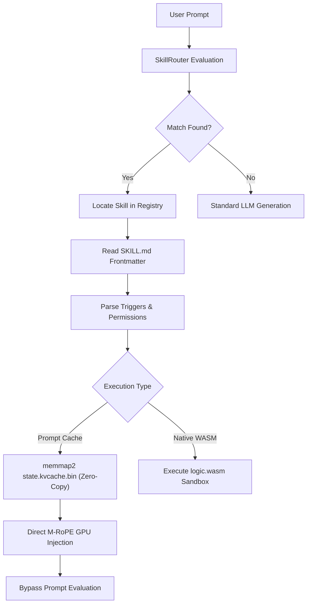

# Skill Architecture & Formats

## 1. Diátaxis: Explanation (Architectural Deep Dive)

This document explains the overarching architecture of Cluaiz Skills, how they are formatted, and exactly how the engine (Neural Foundry) manages them at the hardware level using KV Cache and WebAssembly.

---

## 2. Architectural Flow

When a user interacts with the engine, the `SkillRouter` determines if a skill should be activated based on Semantic triggers or Entropy Thresholds.



---

## 3. `SKILL.md` (The Core Identity)

The `SKILL.md` file contains YAML frontmatter defining the strict schema, followed by the Markdown body representing the agent's core system prompt.

### Frontmatter Schema (Engine Mapped)

The YAML frontmatter perfectly maps to the engine's `SkillManifest` struct in Rust.

| Field | Type | Rust Struct Mapping | Description |
|---|---|---|---|
| `id` | `String` | `manifest.id` | The globally unique identifier.<br><details><summary><b>Engine Handling</b></summary>Used by the Master Registry hashmap for O(1) lookup.</details> |
| `name` | `String` | `manifest.name` | The internal system name.<br><details><summary><b>Engine Handling</b></summary>Must exactly match the directory name. The engine's file scanner relies on this for path resolution.</details> |
| `title` | `String` | `manifest.title`| Short display title. **Max 80 characters.**<br><details><summary><b>Engine Handling</b></summary>Used by UI Engine (CLI/TUI) to render cards. Exceeding limit breaks UI layout. Must be punchy, not a sentence.</details> |
| `version` | `String` | `manifest.version` | Semver string (e.g., `1.0.0`). |
| `description` | `String` | `manifest.description`| Dense semantic summary. **Max 360 characters.**<br><details><summary><b>Engine Handling</b></summary>Fed directly into embedding model. 360 chars is optimal for dense vector representation without diluting meaning or wasting VRAM.</details> |
| `keywords` | `Vec<String>`| `manifest.keywords`| Rapid AI matching triggers. **Max 10 tags.**<br><details><summary><b>Engine Handling</b></summary>Exceeding 10 tags causes Semantic Entropy Dilution (keyword stuffing), which actively degrades engine confidence score during vector similarity search.</details> |
| `author` | `String` | `manifest.author` | Creator name. |
| `soul_type` | `String` | `manifest.soul_type` | Low-level execution mode (e.g., `PROMPT_CACHE`, `STEERING_VECTOR`, `LORA_PATCH`). |
| `triggers.semantic` | `Vec<String>` | `triggers.semantic` | Natural language phrases that the `SkillRouter` listens for. |
| `triggers.entropy_threshold` | `f32` | `triggers.entropy_threshold`| Strict confidence baseline (0.0 to 1.0).<br><details><summary><b>Engine Handling</b></summary>If vector similarity score is below this, engine aborts loading to prevent hallucinations.</details> |
| `triggers.hard_trigger_tokens`| `Vec<String>`| `triggers.hard_trigger_tokens`| Exact string matches that bypass semantic search and force immediate `EAGER` load of skill into RAM. |
| `permissions.level` | `String` | `permissions.level` | Security boundary (`ReadOnly`, `ReadWrite`, or `Admin`). |
| `permissions.filesystem` | `bool` | `permissions.filesystem`| File IO access.<br><details><summary><b>Engine Handling</b></summary>If `false`, Syscall Interceptor immediately kills WASM sandbox on file read attempt.</details> |
| `permissions.network` | `bool` | `permissions.network` | Outbound network access.<br><details><summary><b>Engine Handling</b></summary>If `false`, Syscall Interceptor kills WASM sandbox on outbound HTTP request attempt.</details> |
| `permissions.mcp_servers` | `Vec<String>` | `permissions.mcp_servers` | Allowed MCP connections. |
| `core_metadata.token_count` | `usize` | `Core_metadata.token_count`| Exact pre-computed token footprint of the `SKILL.md` body.<br><details><summary><b>Engine Handling</b></summary>VRAM Arbiter uses this to verify physical GPU memory before M-RoPE injection, preventing OOM crashes.</details> |
| `links` | `Object` | (Handled by Resource Loader)| Relative paths to `logic.wasm` and `state.kvcache.bin`.<br><details><summary><b>Engine Handling</b></summary>Engine uses `memmap2` to map files directly from SSD to physical RAM, skipping I/O bottlenecks.</details> |

### The Agent Prompt (Markdown Body)

Everything below the closing `---` of the frontmatter is the agent's core identity. It is injected at the very beginning of the context window.
It should contain:

1. **Core Identity:** Who the agent is and what its parameters are.
2. **Overarching Rules:** Non-negotiable behavioral constraints.

---

## 4. Folder Architecture (On Disk)

A skill is a directory placed inside `skills/<category>/<skill-name>/`.

```text
skills/<category>/<skill-name>/
├── SKILL.md                 # Required — Entry point with YAML frontmatter & core prompt
├── state.kvcache.bin        # Optional — Pre-computed KV cache (Persistent memory)
├── manifest.json            # Optional — Legacy fallback for older extensions
├── scripts/                 # Optional — Dynamic execution logic (.rhai, .cell, .wasm, .yaml)
├── references/              # Optional — Static context documents for Engine RAG chunking
└── .cache/                  # ⚠️ ENGINE AUTO-GENERATED (Do not manually create or commit)
    └── *.kvcache.bin        # Compiled model-specific KV Cache state (e.g., bonsai1-8b.kvcache.bin)
```

- **Naming Convention:** The directory name is the skill identifier and must be `kebab-case` (e.g., `frontend-dev`, `minimax-music-gen`).

### The `scripts/` Directory (Execution Logic)
Unlike simple LLMs, Cluaiz allows skills to execute strict programmatic logic. The engine natively supports multiple execution formats inside the `scripts/` folder:
- **`.cell` (Cluaiz Execution Language):** The engine's native, highly-optimized internal logic format. Used to define extension plugins and tool behaviors.
- **`.rhai` (Legacy):** Tier-4 execution architecture for backward compatibility.
- **`AUTO_WASM` & `.wasm`:** For memory-safe sandboxed execution. The engine uses zero-copy FFI buffers to communicate with the WASM runtime.
- **`.yaml` / `.json`:** For declarative tool chaining.

### The `references/` Directory (Context & RAG)
This directory acts as the static memory bank for the skill. 
- *Why create it?* Instead of stuffing massive documentation into `SKILL.md` (which bloats the context), you place raw `.md` or `.txt` files here.
- *How it works:* The engine's chunker automatically parses these references and integrates them into the KV Cache or retrieves them dynamically when the agent needs domain-specific knowledge.

---

## 5. Engine Auto-Generated Assets & Hardware Execution

The Cluaiz Engine handles skills fundamentally differently from standard text prompts to achieve zero-latency.

> [!TIP]
> **Automatic KV Cache Generation (`.cache/*.kvcache.bin`)**
> Developers **DO NOT** manually create `.kvcache.bin` files. 
> - **Generation:** When a skill is loaded for the first time, the engine automatically compiles the core prompt and references into a `.kvcache.bin` file specific to the active model (e.g., `bonsai1-8b.kvcache.bin`).
> - **Execution:** When the `SkillRouter` triggers the skill, the engine uses `memmap2` to map the `.kvcache.bin` directly into physical RAM (`PagedKVCache`). It performs a native **M-RoPE** injection into the GPU, bypassing the prompt evaluation phase entirely.
> - **Control:** This behavior can be controlled via the engine's Dual-Cache configurations and the VRAM Arbiter's `force_vram_reclaim` flag, which performs live silicon probes before injection.

> [!IMPORTANT]
> **Manifest Fallback Priority**
> The Engine's standard entry point is `SKILL.md` (which contains the YAML frontmatter). However, for backwards compatibility with legacy extension plugins, the registry scanner still supports `manifest-extension.yaml` and `manifest.json`. The resolution priority is: `SKILL.md` → `manifest-extension.yaml` → `manifest.yaml` → `manifest.json`.
