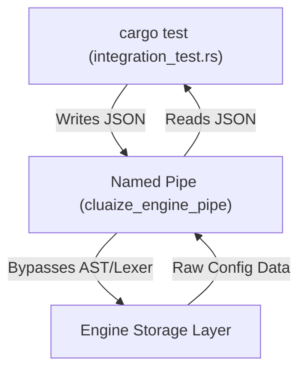

# 4. Local Testing with IPC Named Pipes

When developing an extension, booting up the entire Cluaize LLM inference engine just to see if your C-Pointer logic works is extremely inefficient. 

Instead, you should test your extension locally using **Named Pipes (IPC)**. The Cluaize Engine daemon exposes an IPC pipe that allows you to simulate the exact payload your extension will receive.

---

## Step 1: Start the Engine Daemon

Before running tests, ensure the Cluaize core engine is running in background server mode. This activates the IPC Pipe.

```bash
cd Cluaize/
cargo run serve
```

---

## Step 2: Write an Integration Test

In your extension project, create a `tests/integration_test.rs` file. This test will connect to the Engine's pipe, ask for the system settings (bypassing CEL completely), and verify the output.

```rust
use tokio::io::{AsyncReadExt, AsyncWriteExt};
use tokio::net::windows::named_pipe::ClientOptions;

#[tokio::test]
async fn test_fetch_booster_settings() {
    // 1. Connect directly to the Cluaize Engine's local pipe
    let mut client = ClientOptions::new()
        .open(r"\\.\pipe\cluaize_engine_pipe")
        .expect("Engine must be running via 'cargo run serve'");

    // 2. Send a mock payload simulating the Engine's C-Pointer pass
    // We use GET_SETTINGS to directly query the OS Layer, bypassing CEL.
    let request = serde_json::json!({
        "action": "GET_SETTINGS"
    });
    
    client.write_all(request.to_string().as_bytes()).await.unwrap();

    // 3. Read the Engine's response
    // Use a loop to handle chunked responses from Windows Named Pipes
    let mut response_bytes = Vec::new();
    let mut buf = vec![0; 8192];
    
    let engine_data: serde_json::Value = loop {
        let n = client.read(&mut buf).await.expect("Failed to read from pipe");
        if n == 0 { break serde_json::json!({}); }
        
        response_bytes.extend_from_slice(&buf[..n]);
        if let Ok(json) = serde_json::from_slice(&response_bytes) {
            break json;
        }
    };
    
    // 4. Assert the values
    let think_mode = engine_data.get("system_booster")
        .and_then(|b| b.get("think_mode"))
        .and_then(|t| t.as_str())
        .unwrap_or("Off");

    println!("Successfully fetched from IPC Pipe: {}", think_mode);
    assert_ne!(think_mode, "");
}
```

## Why Test Like This?



By testing against the IPC Pipe:
1. **You avoid hardcoding paths** (`C:/Users/.../config.json`).
2. **You guarantee the data is identical** to what the Engine injects into the C-Pointer during production.
3. **Tests run in milliseconds**, as they bypass the LLM and the CEL Lexer overhead.
