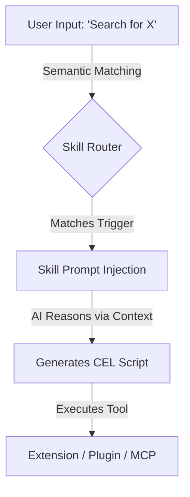

# 1. Create Your First AI Skill

In Cluaize, **Skills** represent the "Brain" of the operation. While Extensions, Plugins, and MCPs provide the raw computational muscle, a Skill provides the neural context and step-by-step instructions (prompts) to tell the AI *how* and *when* to use those muscles.

---

## The Skill Architecture

A Skill does not contain executable binary code. Instead, it contains highly structured system prompts and trigger conditions.



## Step 1: The Skill Manifest

Create a `manifest-skill.yaml`. This file tells the engine what capabilities the skill has and what underlying dependencies (muscle) it requires to function.

```yaml
# =====================================================================
# CLUAIZE SKILL MANIFEST (manifest-skill.yaml)
# =====================================================================
name: "research-assistant"
version: "1.0.0"
description: "Equips the AI with the ability to perform deep web research using the search extension."
author: "Cluaiz Engineers"
type: "skill"

discovery:
  # When the user types these words, the engine will activate this skill.
  semantic_triggers: ["research", "search the web", "look up"]
  
dependencies:
  # This skill requires the search extension to be loaded in order to function
  extensions:
    - "cluaize-search"
```

## Step 2: The `SKILL.md` File

Every skill must have a Markdown file (`SKILL.md`) containing the precise system instructions for the LLM. 

When the user triggers the skill, the Engine dynamically injects the contents of `SKILL.md` into the active inference context window.

```markdown
# Deep Web Research Protocol

You are an expert researcher. When the user asks you to find information, you MUST adhere to the following protocol:

1. **Analyze the Request:** Break down the user's query into 2-3 core search terms.
2. **Execute the Search:** Use the `cluaize-search` extension to fetch data.
3. **Synthesize:** Once the engine returns the result, summarize it concisely in bullet points.
4. **Cite Sources:** Always append the URLs provided in the search result payload.

> [!WARNING]
> Do NOT hallucinate answers. If the search extension returns an error or no results, you must inform the user exactly what failed.
```

> [!NOTE]
> The AI is smart, but it doesn't automatically know *how* to call the `cluaize-search` extension. Proceed to **Part 2: Prompt Engineering with CEL** to learn how to teach the AI the correct grammar.
