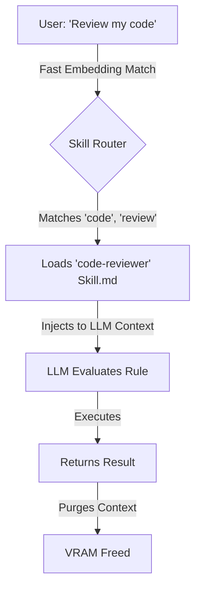

# 3. Dynamic Context Injection (VRAM Management)

A common mistake in traditional LLM applications is the "God Prompt"—dumping every single instruction, tool, and rule into the system prompt at boot time.

In Cluaize, this is an anti-pattern. Large system prompts consume massive amounts of VRAM (KV Cache) and drastically reduce response times.

## How Cluaize Solves This

Cluaize uses **Dynamic Context Injection**. 

Instead of loading every Skill into memory at once, the Engine uses the `discovery.semantic_triggers` defined in your `manifest-skill.yaml` to route inputs.

## Step 1: Small, Modular Skills

To take advantage of this architecture, you must write granular skills.

### Instead of this (Anti-Pattern):
`SKILL.md` (The God Prompt - 2000 lines):
*"You are an AI. If the user asks for math, do X. If they ask for search, do Y. If they ask for github, do Z."*

### Do this (Modular Skills):
**Skill 1: `math-assistant`**
`discovery.semantic_triggers: ["calculate", "math"]`
`SKILL.md`: *"Use the math plugin to calculate expressions."*

**Skill 2: `github-assistant`**
`discovery.semantic_triggers: ["pull request", "issue"]`
`SKILL.md`: *"Use the github MCP server to fetch PRs."*

## Step 2: The JIT Injection (`mid_layer_jit_injection`)

If your skill orchestrates a powerful Extension that generates massive amounts of data (like a database returning 50,000 rows), feeding that into the LLM context will instantly cause an Out-Of-Memory (OOM) crash.

To handle this, Extensions can use `mid_layer_jit_injection: true`. 
When the extension executes, instead of returning the 50,000 rows to the LLM, the Extension injects a **new, temporary skill** (a summarization prompt) directly into the Mid-Layer. The engine runs a sub-inference on the data in chunks, and only returns the final summary to the primary LLM session.

By structuring your Skills carefully, you ensure the Engine remains lightning-fast and VRAM-efficient.
